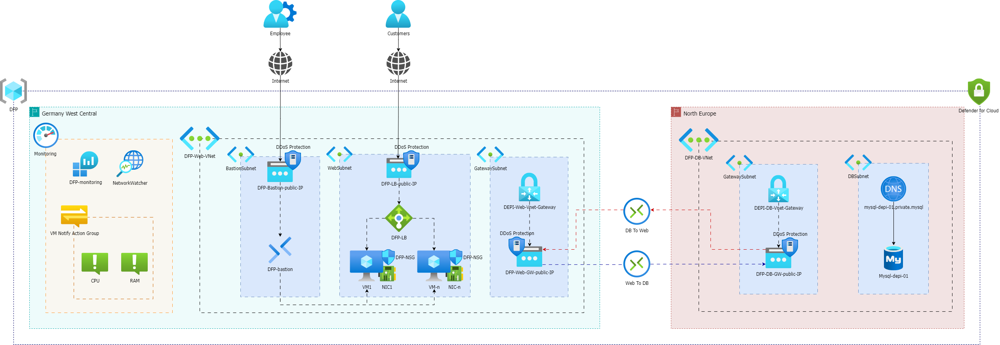

<p align="center">
    
</p>
<p align="center">
    <h1 align="center">Azure All-In-One Solution</h1>
</p>
<h3 align="center">
    
    
    
    
</h3>

<p align="left">
   Welcome to the <strong>Azure All-In-One</strong> repository, which was created as part of the DEPI scholarship program. This project demonstrates a secure, multi-region, high-availability cloud architecture built on Azure, using best practices for networking, security, monitoring, compute, and database management.
</p>

## Project Overview

This project implements an infrastructure designed for scalability, availability, and security, across two Azure regions:
- **Germany West Central**: Hosts the application and monitoring infrastructure.
- **North Europe**: Houses the database infrastructure.

Each component is meticulously deployed using Infrastructure-as-Code (IaC) via ARM templates, split into the following key areas:

### Key Components
1. **Security**: 
   - **DDoS Protection** on all key public endpoints.
   - **Network Security Groups (NSG)** applied to control inbound and outbound traffic.
   - **Azure Bastion** provides secure and seamless RDP/SSH access to VMs without exposing public IPs.
   
   File: `security.json`

2. **Network**:
   - **Azure Virtual Networks (VNet)** with subnets for web and database layers.
   - **Virtual Network Gateway** for secure communication between regions.
   - **VPN Connections** between regions to ensure secure data transfer.

   File: `network.json`

3. **Compute**:
   - **Azure Load Balancer** distributes traffic across VMs in the web tier.
   - **Virtual Machines (VMs)** provisioned for hosting the web application with autoscaling capabilities.
   - **Custom Scripts/Extensions** deployed on VMs to automate post-provisioning tasks.
   - Managed disks attached for storage.

   File: `compute.json`

5. **Monitoring**:
   - **Azure Monitor** and **Network Watcher** configured for tracking system health and performance.
   - **VM Notify Action Groups** set to alert based on CPU and RAM usage thresholds.

   File: `monitoring.json`

6. **Database**:
   - **Azure MySQL Flexible Server Database** hosted in the North Europe region.
   - Private DNS setup for secure communication between services.

   File: `database.json`

## Architecture Diagram



### Technologies Used
- **Azure Virtual Machines**: Hosting the application in Germany West Central.
- **Azure MySQL Database**: The database is hosted in North Europe.
- **Azure Load Balancer**: Ensures high availability by distributing traffic across multiple VMs.
- **Azure Bastion**: For secure and seamless RDP/SSH access to the VMs.
- **Azure Network Security Groups (NSG)**: Protect the infrastructure by defining inbound and outbound traffic rules.
- **Azure DDoS Protection**: Provides enhanced security for both web and database layers.
- **Azure Monitor & Network Watcher**: Real-time monitoring of network and system resources.
- **Azure DNS**: Managing private DNS zones for the MySQL server.

## Repository Structure

- `templates/`: Contains ARM templates for infrastructure as code (IaC) deployment.
- `scripts/`: Custom scripts to configure the virtual machines and databases.
- `README.md`: Documentation related to the project.
- `AZ_Architecture.png`: Architecture diagram of the solution.

## How to Use

1. **Clone the repository:**
   ```bash
   git clone https://github.com/Hassan-Eid-Hassan/azure-all-in-one.git
   cd azure-all-in-one
   ```
2. **Deploy Infrastructure:**
   Use the provided ARM templates in the `templates/` folder to deploy the infrastructure using Azure CLI:
   ```bash
   az deployment group create --resource-group <your-resource-group> --template-file templates/network.json
   ```
3. **Monitor and Manage:**
   Once deployed, monitor the infrastructure using Azure Monitor and Network Watcher, and use action groups to trigger notifications based on performance thresholds.

## Future Improvements
- **Autoscaling:** Implement autoscaling for virtual machines based on load.
- **CI/CD Pipeline:** Add CI/CD automation for application deployment using Azure DevOps or GitHub Actions.
- **Cost Optimization:** Implement cost management and recommendations for future iterations.

## Conclusion
This project demonstrates a real-world application of the concepts learned during the DEPI program, integrating various Azure services into a unified solution that can be scaled and monitored effectively.

Feel free to explore the repo and use the templates as a foundation for your Azure projects.
